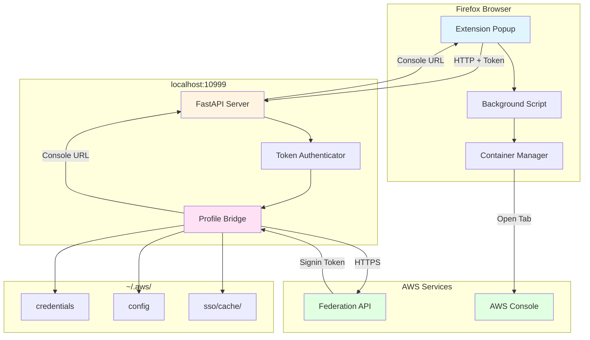
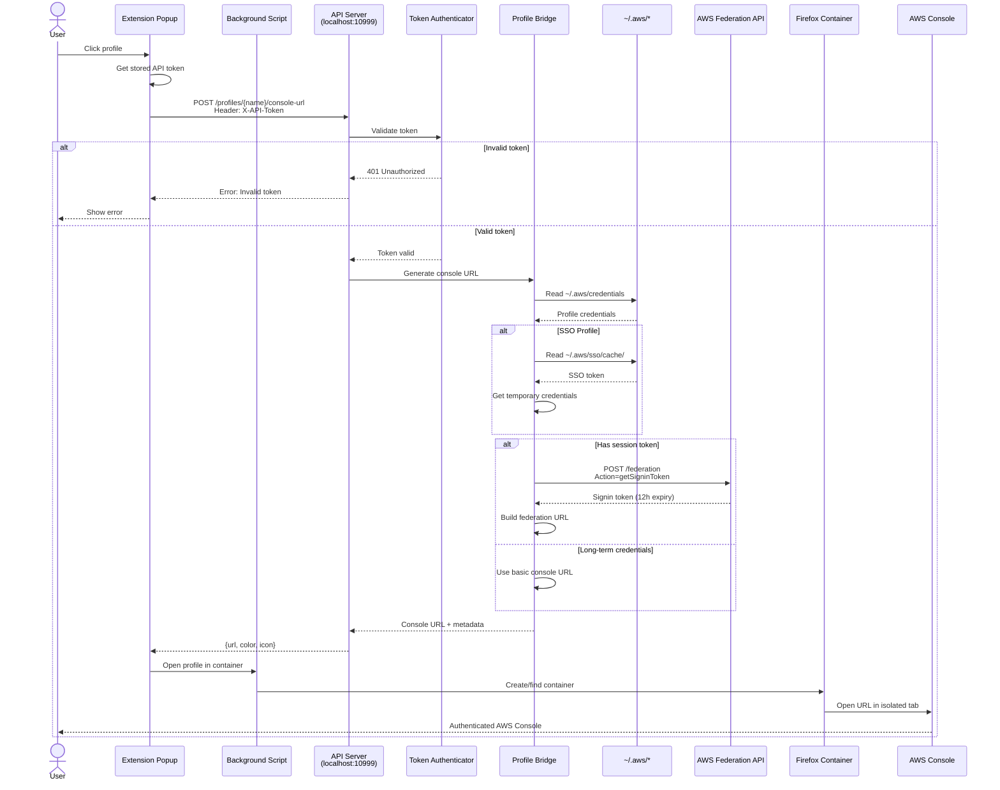

<p align="center">
  
</p>

# AWS Profile Containers

A Firefox extension that reads your AWS credentials file and opens AWS profiles in separate isolated containers with automatic AWS Console federation.

## Background

This project originated from a collection of custom CLI scripts and Firefox extensions for managing AWS profiles. We unified these tools into a cohesive browser extension that combines CLI efficiency with browser integration, all built on Firefox's native container technology.

## ⚠️ Security Notice

**This extension reads sensitive AWS credentials from your local filesystem.**

- ✅ **Read** `~/.aws/credentials` (local only)
- ✅ **Calls** AWS Federation API (official AWS service)
- ❌ **Never stores** credentials in browser storage
- ❌ **Never transmits** credentials to any server except AWS
- 📖 **[Read full security documentation](docs/security/security-root.md)** before installing

## Features

### Core Functionality

- 🔐 **AWS Console Federation**: Automatically generates authenticated console URLs
- 🔒 **Container Isolation**: Each AWS profile opens in its own Firefox container
- 📁 **Automatic Profile Detection**: Reads profiles from `~/.aws/credentials` and `~/.aws/config`
- 🔑 **AWS IAM Identity Center (SSO)**: Full support for SSO profiles
- ⏰ **Credential Monitoring**: Shows credential expiration status for both credential-based and SSO profiles
- 🌍 **Region Selector**: Choose AWS region before opening console
- 🚀 **Automated Builds**: GitHub Actions workflow for building releases

### UX Enhancements

- 🔍 **Search/Filter**: Quick profile search as you type
- ⭐ **Favorites**: Star frequently-used profiles
- 🕐 **Recent Profiles**: Tracks your last 10 opened profiles
- 📊 **Smart Organization**: Profiles grouped by Favorites → Recent → All
- 🎨 **Smart Color Coding**: Automatically assigns colors based on environment
  - Production profiles → Red
  - Staging profiles → Yellow
  - Development profiles → Green
  - Test/QA profiles → Turquoise
  - Integration profiles → Blue
  - Janus profiles → Purple

## Architecture Overview



## How It Works

The extension uses a **local HTTP API server** that bridges between the browser and your AWS credentials:

```mermaid
flowchart LR
    A[User clicks profile] --> B[Extension sends HTTP request]
    B --> C[API validates token]
    C --> D[Read credentials from disk]
    D --> E[Call AWS Federation API]
    E --> F[Receive signin token]
    F --> G[Generate console URL]
    G --> H[Return URL to extension]
    H --> I[Open in Firefox container]
    
    style A fill:#e1f5ff
    style C fill:#fff4e1
    style E fill:#ffe1f5
    style I fill:#e1ffe1
```



**Key Security Points:**

- Credentials never leave your local machine except to AWS's official API
- API server binds to localhost (127.0.0.1) only
- Token-based authentication between extension and API server
- Extension uses native Firefox containers API (no custom protocols)
- No credentials stored in browser storage
- See [docs/security/security-root.md](docs/security/security-root.md) for full details

## Prerequisites

**For Users (Quick Start):**

- Firefox (latest version recommended)
- Python 3.12+ (for API server)
- `uv` (Python package manager - auto-installed if missing)

**For Developers (Building from Source):**

- **Node.js**: Version 22.14.0+ or 24.10.0+
  - Check your version: `node --version`
  - Install via [nvm](https://github.com/nvm-sh/nvm) or [nodejs.org](https://nodejs.org/)
- **Yarn**: Package manager
  - Install: `npm install -g yarn`
- **Python 3.12+** with `uv`

The version check runs automatically during installation and will provide clear instructions if your Node.js version needs updating.

## Installation

### Quick Start ⚡

The extension uses an **HTTP API server** that runs as a system service.

```bash
# Clone the repository
git clone https://github.com/sam-fakhreddine/aws-containers.git
cd aws-containers

# Install and start the API server
./scripts/install-api-service.sh

# Build the extension
yarn install
yarn build
```

### What Gets Installed

The installation script:

1. ✅ Checks for Python 3.12+
2. ✅ Installs `uv` if not present
3. ✅ Creates virtual environment with `uv`
4. ✅ Installs Python dependencies (FastAPI, boto3, etc.)
5. ✅ Sets up systemd (Linux) or launchd (macOS) service
6. ✅ Starts API server on `http://127.0.0.1:10999`
7. ✅ Generates secure API token in `~/.aws/profile_bridge_config.json`
8. ✅ Verifies server is running

**Platforms:** Linux, macOS (Intel & Apple Silicon)

**Note:** Windows is not currently supported.

### Configure Extension Token

After installation, configure the extension with the API token:

```bash
# Get your API token
cat ~/.aws/profile_bridge_config.json
```

Then in Firefox:

1. Click extension icon
2. Click settings icon (⚙️) in top right
3. Paste the `api_token` value
4. Click "Save Token"
5. Click "Test Connection"

**See [docs/TOKEN_AUTHENTICATION.md](docs/TOKEN_AUTHENTICATION.md) for details.**

### Managing the API Server

**Linux (systemd):**

```bash
# Check status
systemctl --user status aws-profile-bridge

# Start/Stop/Restart
systemctl --user start aws-profile-bridge
systemctl --user stop aws-profile-bridge
systemctl --user restart aws-profile-bridge

# View logs
journalctl --user -u aws-profile-bridge -f
```

**macOS (launchd):**

```bash
# Check status
launchctl list | grep aws-profile-bridge

# Start/Stop
launchctl bootstrap gui/$(id -u) ~/Library/LaunchAgents/com.aws.profile-bridge.plist
launchctl bootout gui/$(id -u)/com.aws.profile-bridge

# View logs
tail -f ~/.aws/logs/aws_profile_bridge_api.log
```

**Manual (for development):**

```bash
# Start server manually
uv run python -m aws_profile_bridge api

# Or with hot reload
ENV=development uv run python -m aws_profile_bridge api
```

### Load the Extension in Firefox

1. Open Firefox and navigate to: `about:debugging#/runtime/this-firefox`
2. Click "Load Temporary Add-on"
3. Navigate to and select: `dist/manifest.json` in the project directory
4. The extension icon should appear in your toolbar

### Test It Out

1. Click the extension icon in your Firefox toolbar
2. You should see a list of all your AWS profiles from `~/.aws/credentials`
3. Click on any profile to open it in a container

### Detailed Installation Guide

For comprehensive installation instructions, troubleshooting, and platform-specific notes, see **[docs/getting-started/install-root.md](docs/getting-started/install-root.md)**

## Usage

### Basic Usage

1. **Click the extension icon** in your Firefox toolbar
2. **Search or browse** your AWS profiles
3. **Select a region** from the dropdown (default: us-east-1)
4. **Click a profile** to open AWS Console in an isolated container

### Features

#### Search & Filter

Type in the search box to instantly filter profiles by name.

#### Favorites (⭐)

- Click the star icon next to any profile to mark it as a favorite
- Favorites appear at the top of the list
- Favorites persist across browser restarts

#### Recent Profiles

- Last 10 opened profiles appear in the "Recent" section
- Helps quickly access frequently-used accounts

#### Region Selection

- Choose your preferred AWS region before opening
- Region is appended to the console URL automatically
- Selection persists across sessions

### Profile Organization

Profiles are automatically organized into sections:

```
┌─────────────────────┐
│ FAVORITES   ★       │  ← Your starred profiles (alphabetical)
├─────────────────────┤
│ RECENT      🕐      │  ← Last 10 used (chronological)
├─────────────────────┤
│ ALL PROFILES        │  ← Everything else (alphabetical)
└─────────────────────┘
```

### Managing Containers

Switch to the "Containers" tab to:

- View all active AWS profile containers
- See container count
- Clear all containers at once

## AWS Credentials File Format

### Credential-Based Profiles

The extension reads standard AWS credentials files from `~/.aws/credentials`:

```ini
[production-account]
aws_access_key_id = AKIA...
aws_secret_access_key = ...
aws_session_token = ...
# Expires 2024-11-10 15:30:00 UTC

[dev-account]
aws_access_key_id = AKIA...
aws_secret_access_key = ...
```

**Features:**

- Detects all `[profile-name]` sections
- Reads expiration from comments (`# Expires YYYY-MM-DD HH:MM:SS UTC`)
- Shows time remaining or expired status
- Works with both static and temporary credentials

### AWS IAM Identity Center (SSO) Profiles

The extension also reads SSO profiles from `~/.aws/config`:

```ini
[profile sso-dev]
sso_start_url = https://my-sso-portal.awsapps.com/start
sso_region = us-east-1
sso_account_id = 123456789012
sso_role_name = DeveloperAccess
region = us-east-1

[profile sso-prod]
sso_start_url = https://my-sso-portal.awsapps.com/start
sso_region = us-east-1
sso_account_id = 987654321098
sso_role_name = ReadOnlyAccess
region = us-east-1
```

**SSO Setup:**

1. Configure your SSO profiles in `~/.aws/config`
2. Run `aws sso login --profile <profile-name>` to authenticate
3. The extension will automatically use cached SSO tokens from `~/.aws/sso/cache/`
4. When the token expires, simply run `aws sso login` again

**SSO Features:**

- Automatically detects SSO profiles from config
- Shows "SSO" badge in the UI for SSO profiles
- Monitors SSO token expiration
- Works seamlessly alongside credential-based profiles

### Disabling SSO Profile Enumeration

If you want to **temporarily disable SSO profile enumeration** (for example, to speed up loading or if you only use credential-based profiles), create an empty `.nosso` file in your `~/.aws/` directory:

```bash
# Create the .nosso file to disable SSO profiles
touch ~/.aws/.nosso
```

**When `.nosso` exists:**

- ❌ SSO profiles will not be loaded from `~/.aws/config`
- ✅ Credential-based profiles continue to work normally
- ⚡ Faster profile loading (no SSO token validation)

**To re-enable SSO profiles**, simply remove the file:

```bash
# Remove the .nosso file to re-enable SSO profiles
rm ~/.aws/.nosso
```

**⚠️ Important:** After creating or removing the `.nosso` file, you **must** click the **"Refresh Profiles"** button in the extension popup to reload profiles from disk. The extension caches profiles for performance, so simply closing and reopening the popup won't pick up the changes.

## Troubleshooting

### Extension Shows "API Server Not Running"

**Problem**: Cannot connect to API server

**Solutions**:

1. Check if API server is running:

   ```bash
   curl http://localhost:10999/health
   ```

2. Start the API server:

   ```bash
   # Linux
   systemctl --user start aws-profile-bridge

   # macOS
   launchctl bootstrap gui/$(id -u) ~/Library/LaunchAgents/com.aws.profile-bridge.plist

   # Manual
   uv run python -m aws_profile_bridge api
   ```

3. Check API server logs:

   ```bash
   tail -f ~/.aws/logs/aws_profile_bridge_api.log
   ```

4. Verify Python version (requires 3.12+):

   ```bash
   python3 --version
   ```

5. Check if port 10999 is available:

   ```bash
   lsof -i :10999
   ```

### No Profiles Showing

**Problem**: Extension can't find AWS profiles

**Solutions**:

1. Check your credentials file exists:

   ```bash
   cat ~/.aws/credentials
   ```

2. Ensure profiles are in standard format with `[profile-name]` headers
3. Check file permissions:

   ```bash
   ls -la ~/.aws/credentials
   ```

4. Verify API token is configured in extension settings

### Credentials Showing as Expired

**Problem**: Your credentials have expired

**Solutions for credential-based profiles**:

1. Refresh your credentials using your preferred AWS credential management tool
2. The extension will automatically detect updated credentials on next refresh

**Solutions for SSO profiles**:

1. Re-authenticate with AWS SSO:

   ```bash
   aws sso login --profile <profile-name>
   ```

2. Or login to all profiles under the same SSO start URL:

   ```bash
   aws sso login
   ```

### SSO Profile Not Working

**Problem**: SSO profile shows as expired or can't open console

**Solutions**:

1. Ensure you've logged in with AWS CLI:

   ```bash
   aws sso login --profile <profile-name>
   ```

2. Check your SSO configuration in `~/.aws/config`:

   ```bash
   cat ~/.aws/config
   ```

3. Verify your SSO cache:

   ```bash
   ls -la ~/.aws/sso/cache/
   ```

4. Check if AWS CLI is installed:

   ```bash
   aws --version
   ```

### Console URL Generation Fails

**Problem**: Can't generate AWS console federation URL

**Solutions**:

1. Check if credentials are temporary (have session token):
   - Long-term credentials will open basic console URL
   - Temporary credentials use AWS Federation API

2. Verify network connectivity to AWS:

   ```bash
   curl -I https://signin.aws.amazon.com/federation
   ```

3. Check API server logs for errors:

   ```bash
   tail -f ~/.aws/logs/aws_profile_bridge_api.log
   ```

### API Server Won't Start

**Problem**: API server fails to start

**Solutions**:

1. Check Python version (must be 3.12+):

   ```bash
   python3 --version
   ```

2. Reinstall with uv:

   ```bash
   ./scripts/install-api-service.sh
   ```

3. Check for port conflicts:

   ```bash
   lsof -i :10999
   # Kill conflicting process if needed
   kill -9 <PID>
   ```

4. Run server manually to see errors:

   ```bash
   uv run python -m aws_profile_bridge api
   ```

## File Locations

- **Extension**: `./dist/`
- **API Server**: Installed as Python package in `~/.local/share/aws-profile-bridge/venv`
- **API Logs**: `~/.aws/logs/aws_profile_bridge_api.log`
- **API Token**: `~/.aws/profile_bridge_config.json`
- **Service Config** (Linux): `~/.config/systemd/user/aws-profile-bridge.service`
- **Service Config** (macOS): `~/Library/LaunchAgents/com.aws.profile-bridge.plist`
- **AWS Credentials**: `~/.aws/credentials`
- **AWS Config**: `~/.aws/config`
- **SSO Cache**: `~/.aws/sso/cache/`

## Project Structure

```
aws-containers/
├── api-server/                  # Python API server
│   ├── src/
│   │   └── aws_profile_bridge/
│   │       ├── api/            # FastAPI routes
│   │       ├── auth/           # Token authentication
│   │       ├── core/           # Business logic
│   │       ├── services/       # SSO services
│   │       └── app.py          # FastAPI app
│   ├── tests/                  # Unit tests
│   └── pyproject.toml          # Python dependencies
├── src/                         # Extension source code
│   ├── popup/                  # Popup UI (React)
│   ├── services/               # API client
│   ├── settings/               # Settings page
│   └── backgroundPage.ts       # Background script
├── scripts/                     # Build & utility scripts
│   └── install-api-service.sh  # API server installer
├── config/                      # Build configuration
│   └── webpack/                # Webpack configs
├── docs/                        # Documentation
└── dist/                        # Built extension (generated)
```

For complete details on the repository structure, see [docs/development/REORGANIZATION.md](docs/development/REORGANIZATION.md).

## Development

### Building from Source

```bash
# Install dependencies
yarn install

# Development build (watch mode)
yarn dev

# Production build
yarn build

# Run tests
yarn test
```

### API Server Development

```bash
# Navigate to API server
cd api-server

# Run tests
uv run pytest

# Run with hot reload
ENV=development uv run python -m aws_profile_bridge api
```

### Modifying the Extension

1. Edit source files in `src/`
2. Run `yarn build` to rebuild
3. Click "Reload" in `about:debugging` to test changes

## Features Overview

| Feature | Status | Description |
|---------|--------|-------------|
| AWS Console Federation | ✅ | Automatic console URL generation |
| Profile Detection | ✅ | Reads `~/.aws/credentials` and `~/.aws/config` |
| AWS IAM Identity Center | ✅ | Full SSO profile support |
| Container Isolation | ✅ | Native Firefox containers |
| Credential Monitoring | ✅ | Shows expiration status for both credential and SSO profiles |
| Auto Color Coding | ✅ | Environment-based colors |
| Search/Filter | ✅ | Real-time profile filtering |
| Favorites | ✅ | Star profiles for quick access |
| Recent Profiles | ✅ | Tracks last 10 opened |
| Region Selection | ✅ | 10 major AWS regions |
| HTTP API | ✅ | FastAPI server with token auth |
| Rate Limiting | ✅ | Prevents brute force attacks |

## Compatibility

- **Firefox**: 60+ (tested on latest)
- **Operating Systems**:
  - ✅ **macOS** - Fully supported (Intel & Apple Silicon)
  - ✅ **Linux** - Fully supported
  - ⚠️ **Windows** - Not currently supported
- **Python**: 3.12+
- **Node.js**: 22.14.0+ or 24.10.0+ (for building)
- **Python Dependencies**:
  - FastAPI (HTTP server)
  - uvicorn (ASGI server)
  - boto3 (AWS SDK)
  - pydantic (data validation)

### Windows Support

Windows support is **not currently implemented** but is technically feasible. Required changes:

- PowerShell installation script (`install.ps1`)
- Windows service configuration
- Path handling for Windows filesystem

If you need Windows support, please open an issue or contribute a PR.

## Security & Privacy

### What We Do

- ✅ Read `~/.aws/credentials` and `~/.aws/config` (local filesystem only)
- ✅ Send temporary credentials to AWS Federation API (HTTPS, official AWS service)
- ✅ Store profile names, favorites, recent list in browser local storage
- ✅ Use native Firefox containers for isolation
- ✅ Token-based authentication for API server

### What We Don't Do

- ❌ Store credentials in browser storage
- ❌ Send credentials to any server except AWS
- ❌ Collect analytics or telemetry
- ❌ Phone home or track usage
- ❌ Share data with third parties
- ❌ Log credentials

### Minimal Permissions

```json
{
  "permissions": [
    "contextualIdentities",  // Create/manage Firefox containers
    "storage"                // Store favorites/recent profiles
  ],
  "host_permissions": [
    "http://127.0.0.1:10999/*",    // Local API server only
    "http://localhost:10999/*",     // Local API server only  
    "https://*.amazonaws.com/*",    // AWS Console domains only
    "https://*.aws.amazon.com/*"    // AWS Console domains only
  ],
  "optional_permissions": [
    "tabs"                   // Requested when opening AWS Console
  ]
}
```

**Security Improvements:**
- ✅ **Host-specific permissions**: Only AWS domains and localhost
- ✅ **Runtime permission requests**: Tabs permission requested when needed
- ✅ **Removed cookies permission**: Not actually required for container isolation
- ✅ **Principle of least privilege**: Minimal default permissions

**📖 For complete security documentation, see [docs/security/security-root.md](docs/security/security-root.md)**

## Contributing

Contributions welcome. Open an issue or submit a pull request.

## License

MIT License - see [LICENSE](LICENSE) file for details.

## Support

For issues:

1. Check the Troubleshooting section above
2. Verify API server is running: `curl http://localhost:10999/health`
3. Check API server logs: `tail -f ~/.aws/logs/aws_profile_bridge_api.log`
4. Check Firefox console for errors: `about:debugging` → "Inspect"
5. Open an issue on [GitHub](https://github.com/sam-fakhreddine/aws-console-containers/issues)

## Sequence Diagram

Complete flow from user click to AWS Console:


