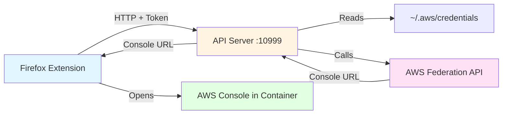

<p align="center">
  
</p>

# AWS Profile Containers

A Firefox extension that reads your AWS credentials file and opens AWS profiles in separate isolated containers with automatic AWS Console federation.

## ⚠️ Security Notice

**This extension reads sensitive AWS credentials from your local filesystem.**

- ✅ **Read** `~/.aws/credentials` (local only)
- ✅ **Calls** AWS Federation API (official AWS service)
- ❌ **Never stores** credentials in browser storage
- ❌ **Never transmits** credentials to any server except AWS
- 📖 **[Read full security documentation](docs/security/security-root.md)** before installing

## Quick Start

### Installation

```bash
# Clone the repository
git clone https://github.com/sam-fakhreddine/aws-containers.git
cd aws-containers

# Install and start the API server
./scripts/install-api-service.sh

# Build the extension
yarn install
yarn build
```

### Load Extension in Firefox

1. Open Firefox and navigate to: `about:debugging#/runtime/this-firefox`
2. Click "Load Temporary Add-on"
3. Navigate to and select: `dist/manifest.json`
4. Click the extension icon in your toolbar

**📖 Detailed Installation Guide**: [docs/getting-started/install-root.md](docs/getting-started/install-root.md)

## Features

### Core Functionality

- 🔐 **AWS Console Federation**: Automatically generates authenticated console URLs
- 🔒 **Container Isolation**: Each AWS profile opens in its own Firefox container
- 📁 **Automatic Profile Detection**: Reads profiles from `~/.aws/credentials` and `~/.aws/config`
- 🔑 **AWS IAM Identity Center (SSO)**: Full support for SSO profiles
- ⏰ **Credential Monitoring**: Shows credential expiration status
- 🌍 **Region Selector**: Choose AWS region before opening console

### UX Enhancements

- 🔍 **Search/Filter**: Quick profile search as you type
- ⭐ **Favorites**: Star frequently-used profiles
- 🕐 **Recent Profiles**: Tracks your last 10 opened profiles
- 🎨 **Smart Color Coding**: Automatically assigns colors based on environment
  - Production → Red | Staging → Yellow | Development → Green

**📖 Complete Features List**: [docs/user-guide/features.md](docs/user-guide/features.md)

## Architecture

The extension uses a **local HTTP API server** that bridges between the browser and your AWS credentials:



**Key Security Points:**

- Credentials never leave your local machine except to AWS's official API
- API server binds to localhost (127.0.0.1) only
- Token-based authentication between extension and API server
- No credentials stored in browser storage

**📖 Detailed Architecture**: [docs/development/architecture.md](docs/development/architecture.md)

## Usage

### Basic Workflow

1. **Click the extension icon** in your Firefox toolbar
2. **Search or browse** your AWS profiles
3. **Select a region** from the dropdown
4. **Click a profile** to open AWS Console in an isolated container

### Profile Organization

Profiles are automatically organized into three sections:

- **⭐ Favorites** - Your starred profiles (alphabetical)
- **🕐 Recent** - Last 10 used profiles (chronological)
- **All Profiles** - Complete list (alphabetical)

### API Server Management

**Linux (systemd):**
```bash
systemctl --user status aws-profile-bridge
systemctl --user restart aws-profile-bridge
journalctl --user -u aws-profile-bridge -f  # View logs
```

**macOS (launchd):**
```bash
launchctl list | grep aws-profile-bridge
launchctl bootstrap gui/$(id -u) ~/Library/LaunchAgents/com.aws.profile-bridge.plist
tail -f ~/.aws/logs/aws_profile_bridge_api.log  # View logs
```

**📖 Complete Usage Guide**: [docs/user-guide/usage.md](docs/user-guide/usage.md)

## Configuration

### AWS Credentials File Format

**Credential-based profiles** (`~/.aws/credentials`):
```ini
[production-account]
aws_access_key_id = AKIA...
aws_secret_access_key = ...
aws_session_token = ...
# Expires 2024-11-10 15:30:00 UTC
```

**SSO profiles** (`~/.aws/config`):
```ini
[profile sso-dev]
sso_start_url = https://my-sso-portal.awsapps.com/start
sso_region = us-east-1
sso_account_id = 123456789012
sso_role_name = DeveloperAccess
region = us-east-1
```

### Extension Token Configuration

After installation, configure the extension with the API token:

```bash
# Get your API token
cat ~/.aws/profile_bridge_config.json
```

Then in Firefox:
1. Click extension icon → settings (⚙️)
2. Paste the `api_token` value
3. Click "Save Token" → "Test Connection"

**📖 Token Authentication Guide**: [docs/TOKEN_AUTHENTICATION.md](docs/TOKEN_AUTHENTICATION.md)

## Troubleshooting

### Extension Shows "API Server Not Running"

```bash
# Check if server is running
curl http://localhost:10999/health

# Start the server
systemctl --user start aws-profile-bridge  # Linux
# or
launchctl bootstrap gui/$(id -u) ~/Library/LaunchAgents/com.aws.profile-bridge.plist  # macOS

# Check logs
tail -f ~/.aws/logs/aws_profile_bridge_api.log
```

### No Profiles Showing

```bash
# Check credentials file exists
cat ~/.aws/credentials

# Verify API token is configured in extension settings
```

### SSO Profile Not Working

```bash
# Re-authenticate with AWS SSO
aws sso login --profile <profile-name>
```

**📖 Complete Troubleshooting Guide**: [docs/user-guide/troubleshooting.md](docs/user-guide/troubleshooting.md)

## Requirements

### For Users (Quick Start)

- Firefox (latest version recommended)
- Python 3.12+ (for API server)
- `uv` (Python package manager - auto-installed if missing)

### For Developers (Building from Source)

- **Node.js**: Version 22.14.0+ or 24.10.0+
- **Yarn**: Package manager
- **Python 3.12+** with `uv`

**📖 Complete Prerequisites**: [docs/getting-started/install-root.md#prerequisites](docs/getting-started/install-root.md#prerequisites)

## Compatibility

- **Firefox**: 60+ (tested on latest)
- **Operating Systems**:
  - ✅ **macOS** - Fully supported (Intel & Apple Silicon)
  - ✅ **Linux** - Fully supported
  - ⚠️ **Windows** - Not currently supported
- **Python**: 3.12+
- **Node.js**: 22.14.0+ or 24.10.0+ (for building)

## Project Structure

```
aws-containers/
├── api-server/             # Python API server (FastAPI)
│   ├── src/                # Source code
│   └── tests/              # Unit tests
├── src/                    # Extension source code
│   ├── popup/              # Popup UI (React)
│   ├── services/           # API client
│   └── settings/           # Settings page
├── scripts/                # Installation & utility scripts
├── docs/                   # Documentation
└── dist/                   # Built extension (generated)
```

**📖 Detailed Project Structure**: [docs/development/REORGANIZATION.md](docs/development/REORGANIZATION.md)

## Documentation

### Getting Started
- [Installation Guide](docs/getting-started/install-root.md)
- [Quick Start](docs/getting-started/quick-start.md)
- [First Steps](docs/getting-started/first-steps.md)

### User Guide
- [Features](docs/user-guide/features.md)
- [Usage](docs/user-guide/usage.md)
- [Managing Profiles](docs/user-guide/profiles.md)
- [Container Management](docs/user-guide/containers.md)
- [Troubleshooting](docs/user-guide/troubleshooting.md)

### Security
- [Security Overview](docs/security/security-root.md)
- [Privacy Policy](docs/security/privacy.md)
- [Best Practices](docs/security/best-practices.md)

### Development
- [Architecture](docs/development/architecture.md)
- [Building from Source](docs/development/building.md)
- [Contributing](docs/development/contributing.md)
- [Testing](docs/development/testing.md)

### API Reference
- [Extension API](docs/api/extension-api.md)
- [API Migration Guide](docs/API_MIGRATION.md)

**📖 Full Documentation Index**: [docs/index.md](docs/index.md)

## Development

### Building from Source

```bash
# Install dependencies
yarn install

# Development build (watch mode)
yarn dev

# Production build
yarn build

# Run tests
yarn test
```

### API Server Development

```bash
cd api-server

# Run tests
uv run pytest

# Run with hot reload
ENV=development uv run python -m aws_profile_bridge api
```

**📖 Complete Development Guide**: [docs/development/building.md](docs/development/building.md)

## Contributing

Contributions welcome! Please:

1. Read the [Contributing Guide](docs/development/contributing.md)
2. Review the [Code of Conduct](CODE_OF_CONDUCT.md)
3. Check [good first issues](https://github.com/sam-fakhreddine/aws-containers/labels/good%20first%20issue)

## Security & Privacy

### What We Do

- ✅ Read `~/.aws/credentials` and `~/.aws/config` (local filesystem only)
- ✅ Send temporary credentials to AWS Federation API (official AWS service)
- ✅ Token-based authentication for API server
- ✅ Use native Firefox containers for isolation

### What We Don't Do

- ❌ Store credentials in browser storage
- ❌ Send credentials to any server except AWS
- ❌ Collect analytics or telemetry
- ❌ Phone home or track usage

**📖 Complete Security Documentation**: [docs/security/security-root.md](docs/security/security-root.md)

## Support

For issues:

1. Check the [Troubleshooting Guide](docs/user-guide/troubleshooting.md)
2. Verify API server is running: `curl http://localhost:10999/health`
3. Check API server logs: `tail -f ~/.aws/logs/aws_profile_bridge_api.log`
4. Check Firefox console: `about:debugging` → "Inspect"
5. Open an issue on [GitHub](https://github.com/sam-fakhreddine/aws-console-containers/issues)

**📖 Complete Support Guide**: [SUPPORT.md](SUPPORT.md)

## License

MIT License - see [LICENSE](LICENSE) file for details.

## Links

- **Repository**: https://github.com/sam-fakhreddine/aws-containers
- **Issues**: https://github.com/sam-fakhreddine/aws-containers/issues
- **Releases**: https://github.com/sam-fakhreddine/aws-containers/releases
- **Changelog**: [CHANGELOG.md](CHANGELOG.md)
