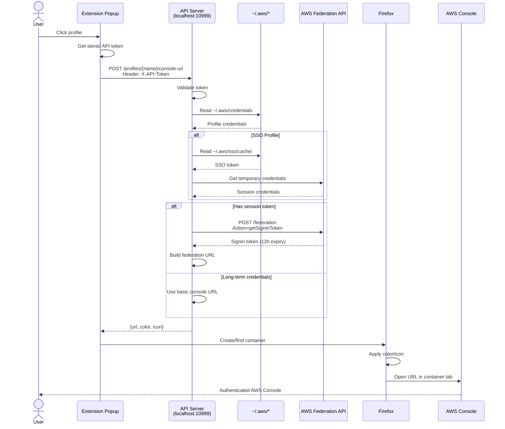

# Architecture Overview

High-level architecture of AWS Profile Containers.

## System Components

AWS Profile Containers consists of two main components:

1. **Firefox Browser Extension** - User interface and container management
2. **HTTP API Server** - Credential handling and AWS integration

```
┌─────────────────────────────────────────────┐
│           Firefox Browser                    │
│  ┌───────────────────────────────────────┐  │
│  │   AWS Profile Containers Extension   │  │
│  │                                       │  │
│  │  ┌─────────────┐   ┌──────────────┐  │  │
│  │  │   Popup UI  │   │   Settings   │  │  │
│  │  │  (React)    │   │    Page      │  │  │
│  │  └──────┬──────┘   └──────────────┘  │  │
│  │         │                            │  │
│  │         │  ┌──────────────┐          │  │
│  │         └──│  API Client  │          │  │
│  │            │   Service    │          │  │
│  │            └──────┬───────┘          │  │
│  └───────────────────┼──────────────────┘  │
│                      │ HTTP (Token Auth)   │
└──────────────────────┼─────────────────────┘
                       │
         ┌─────────────▼──────────────┐
         │  HTTP API Server           │
         │  (localhost:10999)         │
         │                            │
         │  ┌──────────────────────┐  │
         │  │ FastAPI Application  │  │
         │  └──────────┬───────────┘  │
         │             │              │
         │  ┌──────────▼───────────┐  │
         │  │ Profile Bridge       │  │
         │  └──────────┬───────────┘  │
         │             │              │
         │  ┌──────────▼───────────┐  │
         │  │ Credential Provider  │  │
         │  └──────────┬───────────┘  │
         └─────────────┼──────────────┘
                       │
         ┌─────────────▼──────────────┐
         │    Local Filesystem        │
         │  ~/.aws/credentials        │
         │  ~/.aws/config             │
         │  ~/.aws/sso/cache/         │
         └─────────────┬──────────────┘
                       │
         ┌─────────────▼──────────────┐
         │      AWS APIs (HTTPS)      │
         │  - Federation API          │
         │  - SSO API                 │
         └────────────────────────────┘
```

## Communication Flow

### 1. Extension ↔ API Server

The extension communicates with the API server via HTTP:

```
Extension                          API Server
   │                                  │
   │  GET /profiles                   │
   │  X-API-Token: <token>            │
   ├─────────────────────────────────>│
   │                                  │
   │  JSON: [{name, type, ...}]       │
   │<─────────────────────────────────┤
   │                                  │
   │  POST /profiles/{name}/console-url
   │  X-API-Token: <token>            │
   ├─────────────────────────────────>│
   │                                  │
   │  JSON: {url, metadata}           │
   │<─────────────────────────────────┤
```

**Protocol Details:**
- **Transport**: HTTP over localhost (127.0.0.1:10999)
- **Authentication**: Bearer token in `X-API-Token` header
- **Format**: JSON request/response bodies
- **Security**: Localhost-only, CORS restricted to `moz-extension://*`

### 2. API Server ↔ AWS

The API server interacts with AWS services:

```
API Server                         AWS
   │                                │
   │  Read ~/.aws/credentials       │
   ├────────────────────>            │
   │                                 │
   │  GET Federation API             │
   │  (with temp credentials)        │
   ├────────────────────────────────>│
   │                                 │
   │  Signin Token (12h expiry)      │
   │<────────────────────────────────┤
   │                                 │
   │  Build federation URL           │
   │                                 │
```

**AWS Integration:**
- **Credentials**: Read from `~/.aws/credentials` and `~/.aws/config`
- **Federation API**: `https://signin.aws.amazon.com/federation`
- **SSO API**: `https://portal.sso.{region}.amazonaws.com/`
- **Security**: HTTPS only, official AWS endpoints

## Data Flow Sequence

### Opening a Profile in AWS Console



## Extension Architecture

### Component Structure

```
extension/
├── popup/                    # User interface
│   ├── awsProfiles.tsx      # Main profile list component
│   ├── hooks/
│   │   └── useProfiles.ts   # Profile data management
│   └── components/
│       ├── ProfileList.tsx  # Profile rendering
│       └── SearchBar.tsx    # Search/filter
│
├── services/                 # Business logic
│   ├── apiClient.ts         # HTTP API client
│   └── config.ts            # Configuration
│
├── settings/                 # Settings page
│   └── index.tsx            # Token configuration
│
└── types/                    # TypeScript types
    └── index.ts             # Shared type definitions
```

### Key Extension Components

**Popup UI (`popup/awsProfiles.tsx`)**
- Renders profile list (Favorites → Recent → All)
- Handles user interactions (click, search, favorite)
- Manages region selection
- Communicates with API server via `apiClient`

**API Client (`services/apiClient.ts`)**
- HTTP client for API server communication
- Handles authentication (token injection)
- Error handling and retries
- Timeout management (30s default)

**Profile Hook (`popup/hooks/useProfiles.ts`)**
- Fetches profiles from API server
- Manages loading and error states
- Caches profile data
- Provides refresh functionality

**Settings Page (`settings/index.tsx`)**
- Token configuration interface
- Connection testing
- Token storage in browser local storage

### Browser APIs Used

**Container Management:**
```typescript
browser.contextualIdentities.create({
  name: profileName,
  color: profileColor,
  icon: profileIcon
})
```

**Storage:**
```typescript
browser.storage.local.set({
  favorites: [...profileNames],
  recent: [...profileNames],
  apiToken: "..."
})
```

**Tabs:**
```typescript
browser.tabs.create({
  url: consoleUrl,
  cookieStoreId: containerCookieStore
})
```

## API Server Architecture

### Module Organization

```
api-server/src/aws_profile_bridge/
├── app.py                   # FastAPI application setup
├── __main__.py              # CLI entry point
│
├── api/                     # HTTP endpoints
│   ├── health.py            # /health
│   └── profiles.py          # /profiles, /profiles/{name}/console-url
│
├── auth/                    # Authentication
│   ├── authenticator.py     # Token validation
│   ├── token_manager.py     # Token generation
│   └── rate_limiter.py      # Rate limiting
│
├── core/                    # Business logic
│   ├── bridge.py            # Main orchestrator
│   ├── parsers.py           # AWS file parsing
│   ├── credentials.py       # Credential aggregation
│   ├── console_url.py       # URL generation
│   ├── metadata.py          # Color/icon assignment
│   └── url_cache.py         # Console URL caching
│
├── services/                # External integrations
│   └── sso.py               # AWS SSO integration
│
├── middleware/              # HTTP middleware
│   ├── logging.py           # Request/response logging
│   └── extension_validator.py  # Origin validation
│
├── config/                  # Configuration
│   ├── settings.py          # App settings
│   └── logging.py           # Log configuration
│
└── utils/                   # Utilities
    ├── logger.py            # Logging helpers
    └── validators.py        # Input validation
```

### Request Flow

```
HTTP Request
    │
    ▼
[Middleware: Logging] ────> Log request
    │
    ▼
[Middleware: CORS] ────────> Validate origin
    │
    ▼
[Auth: Token Validation] ──> Check X-API-Token header
    │
    ▼
[Auth: Rate Limiting] ─────> Check request rate
    │
    ▼
[API Endpoint] ────────────> Handle request
    │
    ▼
[Core: Bridge] ────────────> Orchestrate operation
    │
    ├──> [Parsers] ────────> Read AWS files
    │
    ├──> [Credentials] ────> Get credentials
    │
    ├──> [Console URL] ────> Generate URL
    │
    └──> [Metadata] ───────> Add color/icon
    │
    ▼
JSON Response ─────────────> Return to extension
```

## Security Architecture

### Trust Boundaries

```
┌─────────────────────────────────────────┐
│ Browser (Untrusted)                     │
│  - Extension UI                         │
│  - User input                           │
└──────────┬──────────────────────────────┘
           │ HTTP + Token
           ▼
┌─────────────────────────────────────────┐
│ API Server (Trusted)                    │
│  - Token validation                     │
│  - Rate limiting                        │
│  - Credential access                    │
└──────────┬──────────────────────────────┘
           │ File I/O
           ▼
┌─────────────────────────────────────────┐
│ Filesystem (Sensitive)                  │
│  - ~/.aws/credentials                   │
│  - ~/.aws/config                        │
└──────────┬──────────────────────────────┘
           │ HTTPS
           ▼
┌─────────────────────────────────────────┐
│ AWS APIs (External)                     │
│  - Federation API                       │
│  - SSO API                              │
└─────────────────────────────────────────┘
```

### Security Measures

**Extension:**
- Minimal permissions (`contextualIdentities`, `storage`)
- Host-specific permissions (localhost + AWS domains only)
- No broad `<all_urls>` permission
- Token stored in encrypted browser storage

**API Server:**
- Localhost binding only (127.0.0.1)
- Token-based authentication (all endpoints except `/health`)
- Rate limiting (prevents brute force)
- CORS restricted to `moz-extension://*`
- No credential logging
- No credential storage

**Communication:**
- HTTP over localhost (no network exposure)
- Credentials never transmitted to extension
- Only console URLs (with temporary tokens) returned
- Tokens rotate on API server restart

## Performance Considerations

### Caching Strategy

**Extension-side:**
- Profile list cached in memory (React state)
- Favorites/recent persisted in browser storage
- Refresh on demand or profile open

**API Server-side:**
- File mtime-based cache for `~/.aws/credentials`
- SSO token cache (memory + disk)
- Console URL cache (TTL-based, default 10 minutes)

### Response Times

| Operation | Typical Time | Notes |
|-----------|-------------|-------|
| GET /health | < 10ms | No I/O |
| GET /profiles | 50-200ms | File reading + parsing |
| GET /profiles/enrich | 2-10s | SSO token validation |
| POST /console-url | 1-2s | AWS Federation API call |
| Profile open (cached) | 100-300ms | Cached console URL |

### Optimization Techniques

1. **Lazy Loading**: Profiles loaded on popup open, not background
2. **Memoization**: React components use `useMemo` for expensive operations
3. **Debouncing**: Search input debounced (300ms)
4. **Batch Operations**: Multiple profiles processed in parallel
5. **Connection Pooling**: FastAPI/httpx connection reuse

## Deployment Architecture

### Installation

```
User runs: ./scripts/manage.sh install
    │
    ▼
[Check for uv] ────────────> Install if missing
    │
    ▼
[Create venv] ─────────────> ~/.local/share/aws-profile-bridge/venv
    │
    ▼
[Install deps] ────────────> FastAPI, boto3, etc.
    │
    ▼
[Configure service] ───────> systemd (Linux) or launchd (macOS)
    │
    ▼
[Start server] ────────────> Runs on port 10999
    │
    ▼
[Generate token] ──────────> ~/.aws/profile_bridge_config.json
```

### Runtime

**Linux (systemd):**
```
systemd user service: aws-profile-bridge.service
    ├─> Starts on boot (user login)
    ├─> Restarts on failure
    ├─> Logs to journald
    └─> Status: systemctl --user status aws-profile-bridge
```

**macOS (launchd):**
```
LaunchAgent: ~/Library/LaunchAgents/com.aws.profile-bridge.plist
    ├─> Starts on login
    ├─> Restarts on failure
    ├─> Logs to ~/.aws/logs/aws_profile_bridge_api.log
    └─> Status: launchctl list | grep aws-profile-bridge
```

## Design Patterns

### Strategy Pattern

**Profile Metadata Rules** (`core/metadata.py`):
```python
class MetadataRule:
    def matches(self, profile_name: str) -> bool: ...
    def get_color(self) -> str: ...
    def get_icon(self) -> str: ...

class KeywordMetadataRule(MetadataRule):
    # Rules for prod → red, dev → green, etc.
```

### Repository Pattern

**File Caching** (`core/parsers.py`):
```python
class FileCache:
    def get(self, file_path: str) -> Optional[str]:
        if self._is_cached(file_path):
            return self._cache[file_path]
        return self._read_and_cache(file_path)
```

### Dependency Injection

All components receive dependencies via constructor:
```python
class ProfileBridge:
    def __init__(
        self,
        credential_provider: CredentialProvider,
        console_url_generator: ConsoleURLGenerator,
        metadata_provider: MetadataProvider
    ):
        # Easy to test, clear dependencies
```

### Factory Pattern

**Container Creation** (Extension):
```typescript
async function createOrFindContainer(profile: Profile): Promise<Container> {
    const existing = await findExistingContainer(profile.name);
    if (existing) return existing;
    return await createNewContainer(profile);
}
```

## Error Handling

### Extension

```typescript
try {
    const profiles = await apiClient.getProfiles();
    setProfiles(profiles);
} catch (error) {
    if (error instanceof ApiClientError) {
        if (error.statusCode === 401) {
            showError("Invalid API token. Check settings.");
        } else if (error.statusCode === 503) {
            showError("API server not running.");
        }
    }
}
```

### API Server

```python
@router.post("/profiles/{profile_name}/console-url")
async def get_console_url(profile_name: str):
    try:
        return bridge.generate_console_url(profile_name)
    except ProfileNotFoundError:
        raise HTTPException(404, "Profile not found")
    except CredentialError:
        raise HTTPException(500, "Failed to get credentials")
    except AWSFederationError:
        raise HTTPException(502, "AWS Federation API error")
```

## Future Enhancements

### Planned Features

1. **WebSocket Support**: Real-time profile updates
2. **Multi-Region**: Support all AWS regions
3. **Profile Groups**: Organize profiles into custom groups
4. **Metrics/Monitoring**: Prometheus metrics, health dashboards
5. **Windows Support**: Windows service configuration

### Scalability Considerations

- API server stateless (can run multiple instances)
- Token validation can use shared cache (Redis)
- Console URL caching reduces AWS API calls
- Profile parsing optimized for large credential files (1000+ profiles)

## Related Documentation

- [Development Architecture](development/architecture.md) - Detailed technical architecture
- [API Migration Guide](../API_MIGRATION.md) - Migration from Native Messaging
- [Security Overview](security/security-root.md) - Security model and best practices
- [API Server README](../api-server/README.md) - API server implementation details
