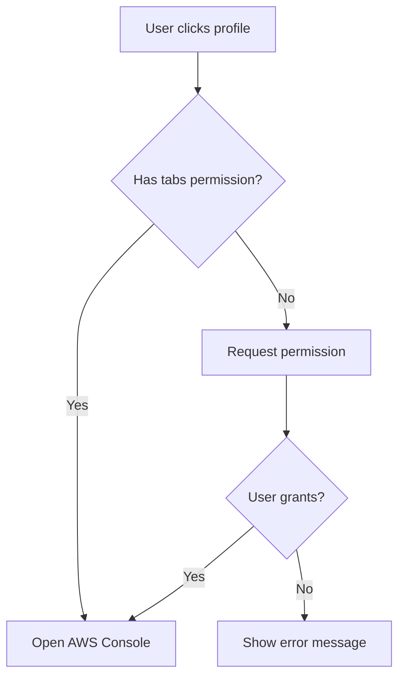

# Extension Permissions Security

## Overview

This document outlines the security improvements made to minimize extension permissions following the principle of least privilege.

## Permission Changes

### Before (Overly Permissive)

```json
{
  "permissions": [
    "contextualIdentities",
    "cookies",           // ❌ Broad access to all website cookies
    "tabs",              // ❌ Access to all tab URLs and titles
    "storage",
    "http://127.0.0.1:10999/*",
    "http://localhost:10999/*"
  ]
}
```

### After (Least Privilege)

```json
{
  "permissions": [
    "contextualIdentities",  // ✅ Required for container management
    "storage"                // ✅ Required for favorites/settings
  ],
  "host_permissions": [
    "http://127.0.0.1:10999/*",    // ✅ Local API server only
    "http://localhost:10999/*",     // ✅ Local API server only
    "https://*.amazonaws.com/*",    // ✅ AWS domains only
    "https://*.aws.amazon.com/*"    // ✅ AWS domains only
  ],
  "optional_permissions": [
    "cookies",  // 🔒 Requested only when needed
    "tabs"      // 🔒 Requested only when needed
  ]
}
```

## Security Improvements

### 1. Host-Specific Permissions

**Before**: Extension could access cookies and tabs from ANY website
**After**: Extension can only access specific AWS domains and localhost

### 2. Runtime Permission Requests

**Before**: Permissions granted automatically at install
**After**: Permissions requested only when needed with user consent

### 3. Minimal Default Permissions

**Before**: 6 broad permissions granted by default
**After**: 2 minimal permissions granted by default

## Permission Usage

### Required Permissions (Always Granted)

- `contextualIdentities`: Create and manage Firefox containers
- `storage`: Store user preferences (favorites, recent profiles, settings)

### Host Permissions (Domain-Specific)

- `http://127.0.0.1:10999/*`: Local API server communication
- `http://localhost:10999/*`: Local API server communication  
- `https://*.amazonaws.com/*`: AWS Console access
- `https://*.aws.amazon.com/*`: AWS Console access

### Optional Permissions (Requested at Runtime)

- `tabs`: Only when opening AWS Console tabs
- `cookies`: Currently unused (reserved for future features)

## Runtime Permission Flow



## Security Benefits

1. **Reduced Attack Surface**: Extension can't access arbitrary websites
2. **User Consent**: Permissions requested with clear purpose
3. **Transparency**: Users see exactly what permissions are needed when
4. **Revocable**: Users can revoke optional permissions anytime
5. **Audit Trail**: Permission requests logged in browser

## User Experience

### First Use
1. Extension installs with minimal permissions
2. User clicks AWS profile
3. Browser prompts: "Extension requests access to browser tabs"
4. User grants permission
5. AWS Console opens in container

### Subsequent Use
- No additional prompts (permission remembered)
- Seamless experience after initial grant

## Compliance

This approach follows:
- ✅ Mozilla Extension Security Guidelines
- ✅ Principle of Least Privilege (NIST)
- ✅ Privacy by Design principles
- ✅ GDPR data minimization requirements

## Migration Notes

Existing users will need to:
1. Update to new extension version
2. Grant tabs permission on first use
3. No data loss or configuration changes

## Future Considerations

- Monitor for additional permission needs
- Consider Manifest V3 migration
- Evaluate WebExtensions Permissions API enhancements